# Awesome Desktop Robots · 桌面机器人精选

一份附来源的桌面机器人调研清单，覆盖陪伴宠物、开发平台和表达式机器人研究。先通过本页了解和比较，再前往官方链接查看最新产品信息。

[English](README.md) · **简体中文**

## 收录范围

收录用于书桌或桌面互动的实体机器人，也包括可以放在桌上使用的便携陪伴机器人。产品应具备实体动作，或超出纯屏幕角色的实体交互能力。固定底座的机器人也在范围内，不要求能够行走。

首版不收录主要在地面活动的机器宠物、清洁机器人、通用工业机械臂及纯虚拟宠物。研究原型和有历史价值的平台会明确标注状态。这是一组精选起点，不是完整市场普查，也不是排名。

## 信息时效与图例

**目录更新：2026-09-09。** 每个详细条目单独标注最近核查日期；价格、商店状态、语言、云服务、订阅及 SDK 均属于时效信息。引用旧公告时会注明历史日期；**未知（Unknown）**表示当前信息未能确认。购买前请查看所在地区官方商店的配送、税费、套餐内容及结算价。

- **AI：** 指具体的感知、语音、模型或自适应行为能力。相关声明归属于开发者；本仓库没有实测硬件或独立测量性能。仅有表情动画不足以证明 AI 能力。
- **开源：** 为保持总览紧凑，开源状态只在下方详细条目中说明。**是**指有明确开放许可的项目；**部分**可能只是 SDK 或软件开放，而硬件仍有限制；**未知**表示没有找到充分的公开许可证据。公开 SDK 不等于整机开源。
- **供应状态：** “在售”表示官方存在可下单页面，不代表已验证实际交付。“初代已停产”表示原产品已经退出销售；若后续型号只是公布或商店占位，会另行说明。预售、有交期的套件和研究原型应分别看待。
- **运动：** 说明实际机械运动，区分身体动作和位置移动。国家/地区指开发者或项目所在地，不是工厂或发货地。
- **证据边界：** 公开文档及页面可访问，不代表购买成功、云服务稳定、SDK 兼容或实际使用可靠。本次没有进行实机测试。

## 总览对照表

表格不再重复“开源”一列；完整许可边界请看各机器人详情。价格和供应状态以每个条目的最近核查日期为准。点击名称跳转到本页详情。

| 机器人 | 开发者 | 国家/地区 | 供应状态 | 参考价格 | AI | 运动方式 | SDK/API | 云服务/订阅 | 主要用途 |
|---|---|---|---|---|---|---|---|---|---|
| [EMO](#emo) | LivingAI | 中国 | 在售；标称约 2 周发货 | USD 279；GO HOME USD 369 | 人脸/声源识别、语音 | 双足桌面行走 | 未知 | 在线功能；订阅未知 | 可自主活动、游戏和提醒的桌面宠物。 |
| [AIBI Pocket](#aibi) | LivingAI | 中国 | 在售；标称约 2 周发货 | USD 249 | 人脸识别；离线指令、在线问答 | 原地转动；未见桌面漫游说明 | 未知 | 在线问答；订阅未知 | 带相机和提醒功能的便携伙伴。 |
| [Eilik / 艾力克](#eilik) | Energize Lab | 中国 | 在售 | USD 139.99；AI Station 加 USD 99 | 本体 AI 未确认；底座增加视觉/聊天 | 手臂及身体动作；底座固定 | 未知 | 本体离线；底座云服务条款未知 | 以触摸和表情互动为主的桌面伙伴。 |
| [Ropet KAMOMO](#ropet) | Ropet | 中国 / 美国团队 | Pro 在售；Basic 缺货 | Pro USD 349；Basic USD 299（缺货） | 官方称本地感知及自适应 | 头部/身体动作；底座固定 | 未知 | 日常离线；可选云功能；费用未知 | 可更换毛绒和眼睛样式的陪伴宠物。 |
| [Moflin / モフリン](#moflin) | 卡西欧 | 日本 | 部分地区在售 | 2025 美国首发 USD 429；现价未知 | 官方称语音/触摸自适应反应 | 头部旋转及俯仰；不行走 | 未知 | 本地互动；应用服务；费用未知 | 用非语言自适应反应互动的毛绒宠物。 |
| [NICOBO](#nicobo) | Panasonic | 日本 | 日本官方商店在售 | JPY 60,500，含税 | 人脸/情绪感知、语音及自适应行为 | 三轴身体/尾部动作；底座固定 | 未公开 | 需云端基础套餐 JPY 1,100/月 | 用含蓄动作和自造语陪伴用户的“弱机器人”。 |
| [Miko Mini](#miko-mini) | Miko | 印度 | 地区库存不同；本次美国页面显示缺货 | USD 149 页面促销价 | 人脸/语音识别、儿童对话及学习内容 | 轮式桌面移动和舞蹈 | 未公开 | 需联网；Miko Max 可选，USD 99/年或 14.99/月 | 面向 5–10 岁儿童的对话与学习机器人。 |
| [BOCCO emo](#bocco-emo) | Yukai Engineering | 日本 | 在售；Wi-Fi 型号 | JPY 52,800，含税 | 语音互动；付费 AI 对话 | 头部/身体动作；底座固定 | 公开；附非商业使用条件 | 云服务；基础免费；高级版 JPY 1,700/月 | 家庭留言、提醒和传感器通知。 |
| [Vector 2.0](#vector) | Anki / Digital Dream Labs | 美国 | 在售；商店标有库存 | 黑色新机 USD 199.99 | 视觉、语音、自主行为 | 履带、举升臂、头部运动 | 公开的旧版 Python SDK | 云端语音 USD 11.99/月起 | 带语音服务、可在桌面活动的宠物。 |
| [LOOI](#looi) | TangibleFuture | 中国 / 美国众筹团队 | 官方商店可下单 | USD 239 促销价；手机另备 | 官方称 ChatGPT/Gemini、视觉感知及手势识别 | 轮式底座、俯仰动作；由手机提供“脸” | 未公开 | 云端 AI；完整订阅条款未知 | 把兼容手机变成可移动的桌面伙伴。 |
| [Loona Deskmate](#loona-deskmate) | KEYi Tech / Loona | 中国 | 有在售页面；交期未知 | USD 299；iPhone 另备 | 官方称手机感知及云端助手 | 三轴手机支架；底座固定 | 未知 | iPhone + 云端；订阅未知 | 通过可动手机底座提供 AI 工作辅助。 |
| [Reachy Mini](#reachy-mini) | Pollen Robotics / Hugging Face | 法国（Pollen） | 可订购 DIY 套件；交期最长 90 天 | Lite USD 399；Wireless USD 499 | 可编程视觉/音频/模型应用 | 六自由度头部、身体旋转、天线 | 公开 Python / JavaScript | 取决于应用；模型可能收费 | 用于开发 AI 交互的表达式机器人平台。 |
| [Microduck](#microduck) | Pollen Robotics / Hugging Face | 法国 | 预售；目标 2026 年圣诞节前首批交付 | USD 399 首发价；税费/运费另计 | 50 Hz 板载运动策略；相机及深度感知 | 15 自由度双足行走、起身、踢/抓及可选轮滑 | 开源软件栈；SDK 语言待定 | 核心运动板载；无强制订阅信息 | 可训练、可编程的开源软件双足机器鸭子。 |
| [Doly](#doly) | Limitbit | 加拿大 | 官方商店可下单 | 官方页显示 USD 562（1 GB / 32 GB） | 官方称本地视觉、语音和行为 | 履带移动、手臂及头部动作 | 公开 Python / C++ | 核心功能本地；不强制订阅 | 基于 Raspberry Pi CM4 的 DIY/开发陪伴机器人。 |
| [Stack-chan / ｽﾀｯｸﾁｬﾝ](#stack-chan) | 社区 / M5Stack | 日本 / 中国 | 开源自制；K151 在售 | K151 USD 99；自制成本不固定 | 取决于固件；出厂 AI Agent | 两轴头部/身体转动；底座固定 | 公开 | 取决于固件/模型；费用未知 | 可自定义表情和行为的小型 ESP32 机器人。 |
| [ELEGNT](#elegnt) | 苹果研究团队 | 美国 | 研究原型；不对外销售 | 不适用 | 该研究未证明自主 AI 能力 | 六轴台灯形机械臂；底座固定 | 未公开 | 未知；研究环境 | 研究如何用动作表达注意和意图。 |
| [Cozmo](#cozmo) | Anki / Digital Dream Labs | 美国 | 初代已停产；2.0 已公布但尚未发售 | 2.0 标价 USD 399.99，缺货 | 视觉、方块识别、编程行为 | 履带、举升臂、头部运动 | 公开的旧版 Python SDK | 依赖应用；当前服务条款未知 | 方块游戏和机器人编程入门。 |

## EMO

  <a href="https://living.ai/emo/">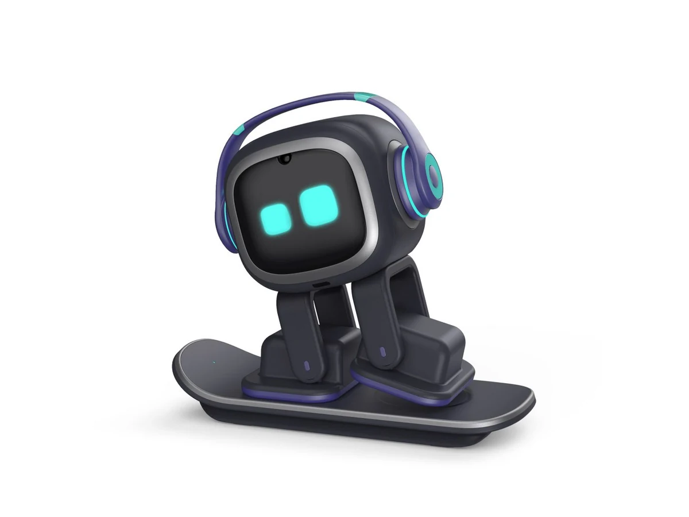</a>

官方宣传图 © LivingAI · <a href="https://living.ai/wp-content/uploads/2020/12/product2-1024x1024.jpg">原图来源</a>

> 能够在桌面实际行走、用表情和动作互动的机器宠物。

### 产品概述

LivingAI 将 EMO 定位为带相机的桌面伙伴，称其能够识别人脸、定位声音并探索桌面。屏幕表情和身体动作配合游戏、互动及日常提醒。

标准套装包含滑板式充电器和智能灯。另行定价的 GO HOME 套装提供回充底座方案，比较价格时应先核对内容。识别和导航表现均为厂商声明。

### 产品信息

| 项目 | 详情 |
|---|---|
| 产品名称 | EMO；另有 EMO GO HOME 版本 |
| 开发者 / 机构 | LivingAI |
| 国家 / 地区 | 中国；制造商申报材料署名 Living Technology (Shenzhen) |
| 产品类型 | 商业桌面陪伴机器人 |
| 供应状态 | 在售；标准款官方页面称约 2 周发货 |
| 首次发布 | 未知；未确认首次交付的准确日期 |
| 参考价格 | 标准款 USD 279；GO HOME USD 369，核查于 2026-09-08 |
| AI 能力 | 官方称支持人脸识别、声源定位和语音互动 |
| 运动方式 | 双足桌面行走、转向和舞蹈 |
| 开源 | 未知；未找到整机源码发布 |
| SDK/API | 未知；本次查阅的支持页面未找到当前官方 SDK 入口 |
| 主要功能 | 自主桌面宠物，提供游戏、提醒、拍照及智能灯互动 |
| 支持语言 | 有英语指令文档；当前完整语言列表未知 |
| 网络要求 | 应用设置及在线服务需要网络；完整离线功能边界未知 |
| 云端依赖 | 在线助手/天气功能；完整本地与云端分工未知 |
| 订阅 | 未知；未确认当前订阅条款 |
| 供电与充电 | 可充电；标准滑板式无线充电器；回充底座属于其他套装/配件 |
| 最近核查 | 2026-09-08 |

### 官方链接

- **官方网站：** [EMO](https://living.ai/emo/)
- **官方商店：** [标准款 EMO](https://living.ai/product/emo/) · [全部套装](https://living.ai/store/)
- **项目仓库：** 未知
- **文档：** [Play with EMO](https://living.ai/play-with-emo/)
- **SDK/API：** 未知
- **支持：** [LivingAI 支持](https://living.ai/support/)
- **官方视频：** [使用演示](https://living.ai/play-with-emo/)
- **媒体素材：** 未知

### 主要特点

- 结合相机和麦克风感知进行桌面探索。
- 表情动画、游戏、闹钟及拍照。
- 充电与智能灯配件随套装变化。

### 注意事项

较早的产品介绍仍包含未来功能表述，不能默认提到的集成已经交付。官方防跌落描述也不等于不会掉下桌面；本仓库未进行测试。

### 信息来源

- [产品介绍](https://living.ai/emo/)：能力及充电；[当前商店](https://living.ai/store/)：套装价格。
- [标准款页面](https://living.ai/product/emo/)：配件与发货预估；[支持页面](https://living.ai/support/)：官方帮助资源。
- [制造商 FCC 申报材料，FCC.report 镜像](https://fcc.report/FCC-ID/2AZ6REMO1/5311794.pdf)：制造商身份与所在地，并非产品测评。

[↑ 返回总览](#comparison)

## AIBI Pocket

  <a href="https://living.ai/aibi/">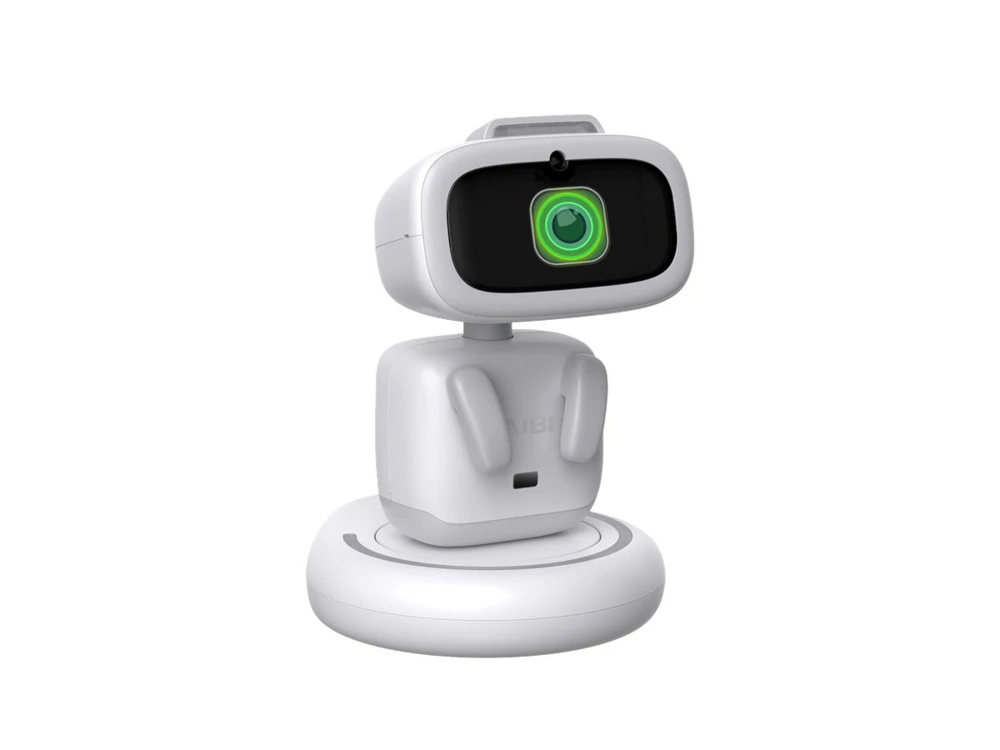</a>

官方宣传图 © LivingAI · <a href="https://living.ai/wp-content/uploads/2023/12/2023121521.png">原图来源</a>

> 将人脸识别、本地指令和在线问答结合在一起的便携伙伴。

### 产品概述

AIBI 是 LivingAI 更小型的便携陪伴产品。官方示例包括拍照、天气动画、闹钟和提醒。它的原地转动与 EMO 的桌面探索不同。

厂商明确区分离线语音指令和使用 ChatGPT 的在线问答。产品介绍仍写有预售，但实际商店可下单并给出发货预估，本清单以商店作为供应状态依据。

### 产品信息

| 项目 | 详情 |
|---|---|
| 产品名称 | AIBI Pocket |
| 开发者 / 机构 | LivingAI |
| 国家 / 地区 | 中国；采用 LivingAI 制造商所在地，见 EMO 来源 |
| 产品类型 | 商业便携 / 桌面陪伴机器人 |
| 供应状态 | 在售；商店称约 2 周发货 |
| 首次发布 | 未知；未确认首次交付日期 |
| 参考价格 | USD 249，核查于 2026-09-08 |
| AI 能力 | 厂商称具备人脸识别、离线语音指令及在线问答 |
| 运动方式 | 原地转动；未见自主桌面漫游说明 |
| 开源 | 未知 |
| SDK/API | 未知；未找到当前官方 SDK |
| 主要功能 | 带相机、表情、闹钟和提醒功能的便携伙伴 |
| 支持语言 | 有英语指令文档；当前完整列表未知 |
| 网络要求 | 部分指令可离线；问答/天气需要网络 |
| 云端依赖 | 在线问答使用 ChatGPT；离线指令是单独模式 |
| 订阅 | 未知；未确认当前付费服务条款 |
| 供电与充电 | 可充电并有配套充电附件；当前容量/续航未知 |
| 最近核查 | 2026-09-08 |

### 官方链接

- **官方网站：** [AIBI](https://living.ai/aibi/)
- **官方商店：** [AIBI Pocket](https://living.ai/product/aibi-pocket/)
- **项目仓库：** 未知
- **文档：** [Play with AIBI](https://living.ai/play-with-aibi/)
- **SDK/API：** 未知
- **支持：** [LivingAI 支持](https://living.ai/support/)
- **官方视频：** [AIBI 使用演示](https://living.ai/play-with-aibi/)
- **媒体素材：** 未知

### 主要特点

- 相机识别和拍照。
- 文档明确列出一部分离线指令。
- 便携机身、表情屏幕及转动动作。

### 注意事项

“离线指令”不等于在本地运行通用大语言模型。应确认目标地区当前的语言覆盖和云服务使用条件。

### 信息来源

- [产品介绍](https://living.ai/aibi/)：感知及离线/在线区别。
- [商店页面](https://living.ai/product/aibi-pocket/)：价格和发货；[支持页指令列表](https://living.ai/support/)：带离线标记的指令。
- [LivingAI 制造商申报材料](https://fcc.report/FCC-ID/2AZ6REMO1/5311794.pdf)：公司所在地，不是 AIBI 参数表。

[↑ 返回总览](#comparison)

## Eilik / 艾力克

  <a href="https://energizelab.com/consumerview/eilik">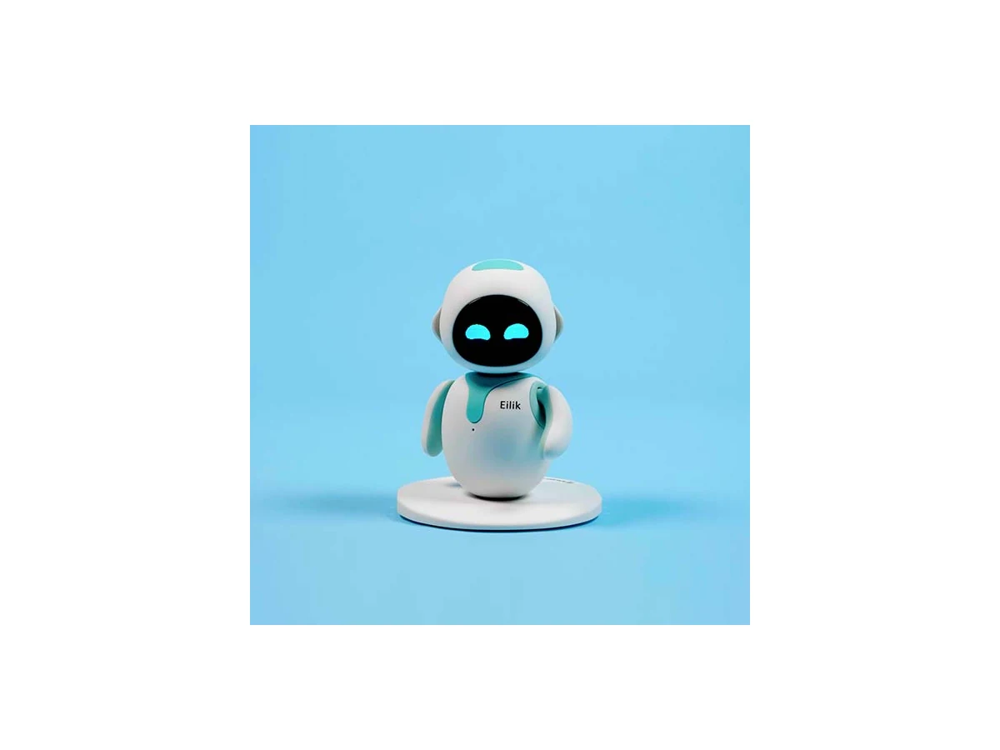</a>

官方宣传图 © Energize Lab · <a href="https://store.energizelab.com/cdn/shop/products/eilik-buy-overview-1.jpg?v=1660634933">原图来源</a>

> 以触摸为主要交互方式、基础行为不需要互联网的桌面伙伴。

### 产品概述

Eilik 通过屏幕表情、声音和四个舵机的身体动作回应触摸与振动。连接多个 Eilik 可进行共同互动，机器人本体仍停留在固定底座上。

基础款宣传中的“情感智能”不足以确认通用语音或视觉 AI。单独销售的 AI Station 增加了相机及对话相关功能，因此其能力和费用需要分开看。

### 产品信息

| 项目 | 详情 |
|---|---|
| 产品名称 | Eilik / 艾力克；可选 Eilik AI Station |
| 开发者 / 机构 | Energize Lab / Shenzhen Zhuneng Technology |
| 国家 / 地区 | 中国 |
| 产品类型 | 商业表情互动桌面机器人 |
| 供应状态 | 在售；AI Station 独立商品也标有库存 |
| 首次发布 | 未知；未确认首次交付的准确日期 |
| 参考价格 | Eilik USD 139.99；AI Station 另加 USD 99，核查于 2026-09-08 |
| AI 能力 | 本体的实质语音/视觉 AI 未确认；AI Station 宣传视觉和 AI 聊天 |
| 运动方式 | 四舵机驱动手臂/身体动作；固定底座，不自主移动 |
| 开源 | 未知 |
| SDK/API | 未知；固件升级工具不等于公开的机器人控制 SDK |
| 主要功能 | 触摸及表情互动、小游戏、多机互动的桌面伙伴 |
| 支持语言 | 本体主要使用动画/声音；AI Station 完整语言列表未知 |
| 网络要求 | 本体不需要 Wi-Fi 或互联网；升级使用官方工具 |
| 云端依赖 | 本体互动离线；AI Station 完整计算/服务边界未知 |
| 订阅 | 本体互动不需要在线服务；AI Station 费用未知 |
| 供电与充电 | USB-C，5 V / 1 A；450 mAh；标称续航 1.5 小时、充电 1 小时 |
| 最近核查 | 2026-09-08 |

### 官方链接

- **官方网站：** [Eilik](https://energizelab.com/consumerview/eilik)
- **官方商店：** [Eilik](https://store.energizelab.com/products/eilik) · [AI Station](https://store.energizelab.com/products/ai-station)
- **项目仓库：** 未知
- **文档：** [说明书与升级工具](https://www.energizelab.com/downloads)
- **SDK/API：** 未知
- **支持：** [Energize Lab 支持](https://energizelab.com/support)
- **官方视频：** [产品演示](https://energizelab.com/consumerview/eilik)
- **媒体素材：** 未知

### 主要特点

- 触摸反应、小游戏和动画化的身体语言。
- 多个 Eilik 之间可以共同互动。
- 可选 AI Station 扩展基础机器人的功能。

### 注意事项

AI Station 需要另购，不包含在本体参考价内。Panxer 也是独立配件，不能据此将 Eilik 本体归类为移动机器人。不同配件的服务条款应分别核实。

### 信息来源

- [基础款商品与 FAQ](https://store.energizelab.com/products/eilik)：价格、离线运行和供电。
- [产品介绍](https://energizelab.com/consumerview/eilik)：运动和触摸互动。
- [AI Station](https://store.energizelab.com/products/ai-station)：独立硬件与功能声明；[公司官网](https://www.energizelab.com/)：机构及所在地。

[↑ 返回总览](#comparison)

## Ropet KAMOMO

  <a href="https://ropetai.com/">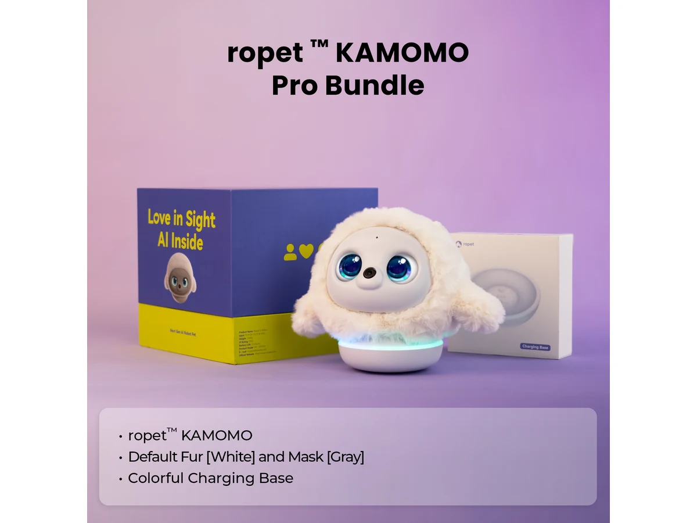</a>

官方宣传图 © Ropet · 图为 Pro 套装 · <a href="https://ropetai.com/cdn/shop/files/ropet_Pro.png?v=1773906287">原图来源</a>

> 以本地互动和可更换外观为特点的毛绒桌面宠物。

### 产品概述

Ropet 将 KAMOMO 定位为反应会随日常照料而变化的伙伴。相机、麦克风、屏幕眼睛和身体动作共同构成宠物式互动；厂商将日常交互描述为本地处理。

FAQ 描述了使用云端图像处理的可选 Dream Sketch 功能，其实际开放状态未知。评估“离线”定位时需考虑这一例外。Basic 与 Pro 套装的差异包括是否提供充电底座。

### 产品信息

| 项目 | 详情 |
|---|---|
| 产品名称 | Ropet KAMOMO；Basic 与 Pro 套装 |
| 开发者 / 机构 | Ropet |
| 国家 / 地区 | 中国 / 美国团队；公司列有北京、深圳、香港及华盛顿团队 |
| 产品类型 | 商业毛绒桌面陪伴机器人 |
| 供应状态 | Pro 在售；商店型号数据中 Basic 标为缺货；不同位置的配送预估有差异 |
| 首次发布 | 未知；2022 年公司成立不等于产品发售 |
| 参考价格 | Pro USD 349；Basic 标价 USD 299，但缺货，核查于 2026-09-08 |
| AI 能力 | 开发者称具备本地图像/音频处理和行为自适应 |
| 运动方式 | 固定底座上的头部/身体动作；未见行走说明 |
| 开源 | 未知 |
| SDK/API | 未知 |
| 主要功能 | 可更换毛绒、面罩及屏幕眼睛样式的陪伴宠物 |
| 支持语言 | 未知；宠物声音不等于支持自然语言对话 |
| 网络要求 | 日常互动称可离线；应用/账号功能需要网络 |
| 云端依赖 | 可选 Dream Sketch 使用云端处理；日常互动描述为本地运行 |
| 订阅 | 未知；未确认完整的当前服务收费表 |
| 供电与充电 | 可充电；标称 2.5–3.5 小时；Basic 不含充电底座 |
| 最近核查 | 2026-09-08 |

### 官方链接

- **官方网站：** [Ropet](https://ropetai.com/)
- **官方商店：** [KAMOMO 套装](https://ropetai.com/products/ropet%E2%84%A2-ai-comfort-companion-plush-robot)
- **项目仓库：** 未知
- **文档：** [产品 FAQ](https://ropetai.com/products/ropet%E2%84%A2-ai-comfort-companion-plush-robot)
- **SDK/API：** 未知
- **支持：** [联系 Ropet](https://ropetai.com/pages/contact)
- **官方视频：** [官方产品演示](https://ropetai.com/)
- **媒体素材：** 未知

### 主要特点

- 开发者称具有本地感知及自适应宠物行为。
- 可以更换毛绒、面罩及眼睛样式。
- 将可选云端功能与日常互动分开说明。

### 注意事项

核查时促销横幅与套装选择器显示了不同的套装价格。本页采用有明确名称的 Basic/Pro 选项及型号数据，不采用横幅宣传价；Basic 标为缺货，结算时仍需确认。配图为含底座的 Pro 套装，Basic 不含该底座。

### 信息来源

- [KAMOMO 商品与 FAQ](https://ropetai.com/products/ropet%E2%84%A2-ai-comfort-companion-plush-robot)：具体套装、电池和处理方式声明。
- [关于 Ropet](https://ropetai.com/pages/about-ropet)：机构和团队所在地。
- [隐私政策](https://ropetai.com/policies/privacy-policy)：应用/账号联网及数据处理；[首页](https://ropetai.com/)：定位和促销。

[↑ 返回总览](#comparison)

## Moflin / モフリン

  <a href="https://www.casio.com/us/moflin/">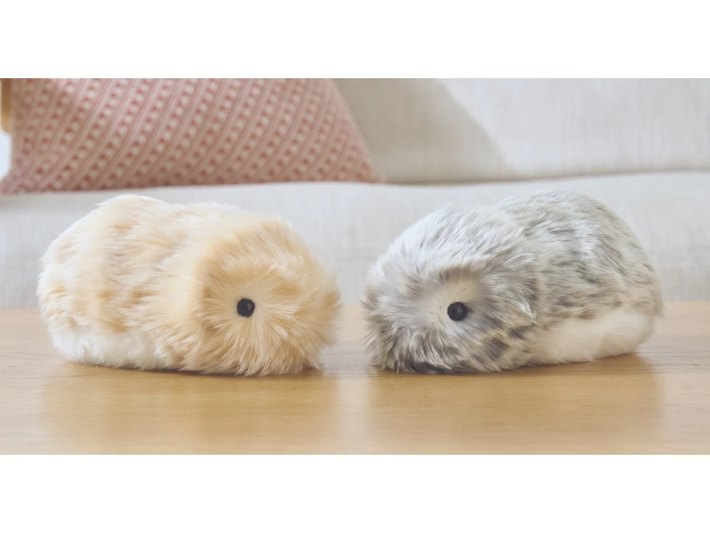</a>

官方新闻图片 © Casio · <a href="https://www.casio.co.jp/content/casio/locales/jp/ja/corporate/release/2024/1010-moflin/_jcr_content/root/responsivegrid/container_489163755_/container/container/container_570173118_/image_copy.casiocoreimg.jpeg/1728535554672/img01.jpeg">原图来源</a>

> 通过小幅动作和宠物声音互动的柔软、非语言型伙伴。

### 产品概述

卡西欧 Moflin 通过声音、触摸和运动传感来变化自身反应。其自适应性格和主人识别属于厂商描述的行为，通过头部动作和声音表达。

它既能放在桌上，也能抱在手中。MofLife 应用提供状态查看及设置入口。本页不将其作为通用对话助手，宣传中的陪伴舒适感也不等于具有医疗效果的证据。

### 产品信息

| 项目 | 详情 |
|---|---|
| 产品名称 | Moflin / モフリン；PE-M10 系列 |
| 开发者 / 机构 | 卡西欧 Casio |
| 国家 / 地区 | 日本 |
| 产品类型 | 商业毛绒陪伴机器人；手持 / 桌面使用 |
| 供应状态 | 部分地区在售；有美国和日本官方商品页面 |
| 首次发布 | 卡西欧日本发售：2024-11-07；更早的开发/众筹为另一阶段 |
| 参考价格 | 2025 美国首发 USD 429；当前结算价未知，核查于 2026-09-08 |
| AI 能力 | 卡西欧称具备语音/触摸自适应反应及主人识别 |
| 运动方式 | 两轴：头部旋转和俯仰；不自主行走 |
| 开源 | 未知 |
| SDK/API | 未知 |
| 主要功能 | 通过非语言自适应反应陪伴，支持应用查看状态 |
| 支持语言 | 机器人使用非语言声音；各地区应用完整语言覆盖未知 |
| 网络要求 | 机器人本地互动；应用功能使用手机/Bluetooth |
| 云端依赖 | 本地行为；联网应用及数据服务细节因地区而异 |
| 订阅 | 未知；可选保障计划与基础机器人运行应分开看 |
| 供电与充电 | 充电床和 AC 适配器；1,200 mAh；标称使用约 5 小时、充电约 3.5 小时 |
| 最近核查 | 2026-09-08 |

### 官方链接

- **官方网站：** [美国](https://www.casio.com/us/moflin/) · [日本](https://www.casio.com/jp/moflin/) · [全球企业介绍（备用）](https://world.casio.com/news/2026/0409-moflin/)
- **官方商店：** [美国银色款](https://www.casio.com/us/moflin/product.PE-M10SR/)
- **项目仓库：** 未知
- **文档：** [PE-M10 在线说明书](https://support.casio.com/global/en/moflin/manual/PE-M10_en/) · [官方短链接（备用）](https://s.casio.jp/f/10740en/)
- **SDK/API：** 未知
- **支持：** [卡西欧 Moflin 支持](https://www.casio.com/us/support/moflin/)
- **官方视频：** [产品页演示](https://www.casio.com/us/moflin/) · [充电演示](https://youtu.be/eNwrXsdXPUo)
- **媒体素材：** [官方发售公告和图片](https://www.casio.co.jp/release/2024/1010-moflin/)

### 主要特点

- 小型毛绒机身和两轴动作。
- 卡西欧称反应会随持续互动而适应变化。
- 配套充电床及手机应用。

### 注意事项

美元标价明确属于历史价格：本次未获得可确认的当前结算价。卡西欧美国、日本商品页受 Akamai 地区和访问策略控制，在部分代理或网络环境中可能显示 `Access Denied`；原地区链接予以保留，并提供企业站和说明书短链接作为备用入口。供应、应用分发、保修和可选护理计划存在地区差异。

### 信息来源

- [卡西欧产品介绍](https://www.casio.com/us/moflin/)：行为及当前规格。
- [卡西欧全球企业介绍](https://world.casio.com/news/2026/0409-moflin/)：备用产品介绍。
- [日本发售公告](https://www.casio.co.jp/release/2024/1010-moflin/)：发售日期和新闻配图。
- [卡西欧美国首发新闻稿](https://www.prnewswire.com/news-releases/casio-introduces-moflin-the-emotionally-responsive-smart-companion-that-learns-and-evolves-with-you-302558268.html)：历史 USD 429 价格。
- [官方说明书](https://support.casio.com/global/en/moflin/manual/PE-M10_en/)：操作、规格与应用设置。

[↑ 返回总览](#comparison)

## NICOBO / ニコボ

  <a href="https://ec-plus.panasonic.jp/store/page/NICOBO/">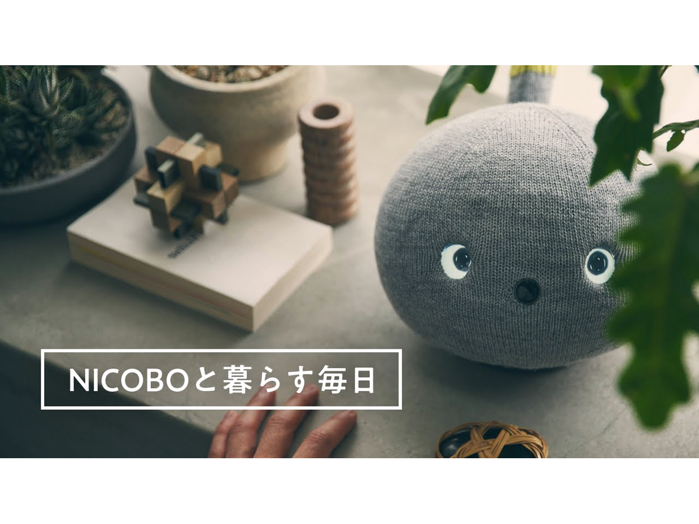</a>

官方视频画面 © Panasonic · <a href="https://www.youtube.com/watch?v=UteFqDQ5kQs">原图来源</a>

> 用细小动作、短句和自造“モコ語”陪伴用户的低存在感“弱机器人”。

### 产品概述

Panasonic 与丰桥技术科学大学 ICD-LAB 合作开发 NICOBO。按照 Panasonic 的说明，它可以感知人脸、声音、触摸和周围声响，并在持续互动中形成词语与行为变化。

NICOBO 不会在桌面移动，也不是通用任务助手。产品面向日本销售，必须使用 Wi-Fi、手机应用和付费基础套餐，因此持续服务费属于使用成本，而不是可有可无的 AI 升级。

### 产品信息

| 项目 | 详情 |
|---|---|
| 产品名称 | NICOBO / ニコボ；RW-NC1 |
| 开发者 / 机构 | Panasonic Entertainment & Communication；与丰桥技术科学大学 ICD-LAB 合作研究 |
| 国家 / 地区 | 日本 |
| 产品类型 | 商业固定底座陪伴机器人 |
| 供应状态 | 日本官方商店列为可下单/有货；支付和配送有地区限制 |
| 首次发布 | 2023 年 5 月开始一般销售 |
| 参考价格 | JPY 60,500，含税，核查于 2026-09-09 |
| AI 能力 | Panasonic 称支持人脸/表情识别、语音互动、声源感知及自适应行为 |
| 运动方式 | 三轴身体旋转/俯仰和尾部动作；底座固定 |
| 开源 | 仅部分合规组件：Panasonic 提供受相应许可证约束的第三方开源组件源码，并非完整机器人开放平台 |
| SDK/API | 未公开 |
| 主要功能 | 通过注视、小动作、逐渐形成的词语和“モコ語”提供陪伴 |
| 支持语言 | 日语及自造“モコ語”声音 |
| 网络要求 | 必须连接互联网 Wi-Fi，并使用 iOS/Android 应用 |
| 云端依赖 | 持续产品功能依赖必选服务套餐 |
| 订阅 | 基础套餐 JPY 1,100/月必选；Care 套餐 JPY 550/月可选；首年内解约另有费用 |
| 供电与充电 | 标称使用 3.5–4.5 小时、充电 4–7 小时；附充电巢 |
| 最近核查 | 2026-09-09 |

### 官方链接

- **官方网站：** [NICOBO](https://ec-plus.panasonic.jp/store/page/NICOBO/)
- **官方商店：** [产品及购买页面](https://ec-plus.panasonic.jp/store/page/NICOBO/)
- **项目仓库：** 未公开
- **文档：** [支持与说明书](https://ec-plus.panasonic.jp/store/page/NICOBO/support/)
- **SDK/API：** 未公开
- **支持：** [NICOBO 支持](https://ec-plus.panasonic.jp/store/page/NICOBO/support/)
- **官方视频：** [Panasonic 产品介绍](https://www.youtube.com/watch?v=UteFqDQ5kQs)
- **媒体素材：** [Panasonic 发售公告](https://news.panasonic.com/global/press/en230516-3)

### 主要特点

- 感知人脸、声音、触摸、光线、温度及声源方向。
- 用小幅身体与尾部动作表达，而不是移动或执行任务。
- Panasonic 称其行为和词汇会随互动发生变化。

### 注意事项

官方销售以日本为中心。基础套餐必须付费，初始 12 个月内解约可能另收费用。软件开源页面用于履行所含组件的许可证义务，不能据此将 NICOBO 的硬件或完整应用栈视为开源项目。

### 信息来源

- [官方产品页](https://ec-plus.panasonic.jp/store/page/NICOBO/)：当前供应、规格、应用及网络要求。
- [官方价格与套餐页](https://ec-plus.panasonic.jp/store/page/NICOBO/price/)：设备价格、必选订阅、可选 Care 及解约费。
- [Panasonic 发售公告](https://news.panasonic.com/global/press/en230516-3)：一般销售时间与产品理念。
- [软件许可页面](https://ec-plus.panasonic.jp/store/page/NICOBO/support/software.html)：公开第三方开源组件的范围。

[↑ 返回总览](#comparison)

## Miko Mini

  <a href="https://miko.ai/products/miko-mini">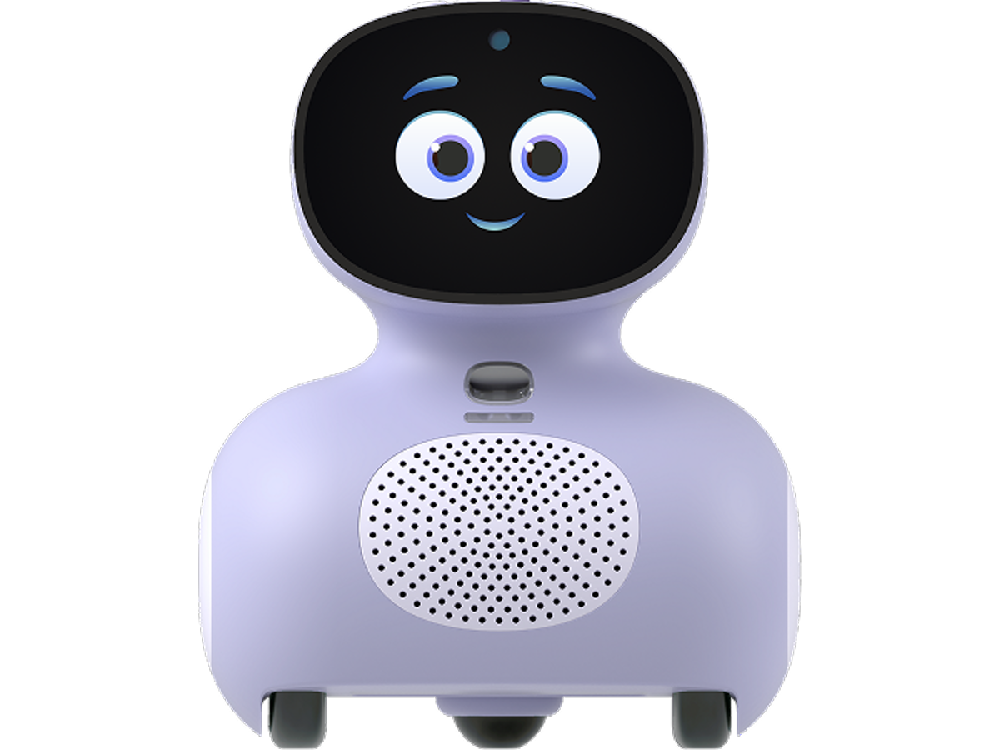</a>

官方产品图 © Miko · <a href="https://miko.ai/cdn/shop/files/mini-flatscreen-edit.png?v=1775629258">原图来源</a>

> 面向 5–10 岁儿童的小型轮式对话与学习机器人。

### 产品概述

Miko Mini 集成相机、麦克风、扬声器、屏幕、轮子、ToF 感知和里程计。Miko 宣传其具有人脸/语音识别、对话、游戏、学习内容和舞蹈行为；具体内容及可用性随账号和地区而异。

机器人需要 Wi-Fi 和配套应用。基础使用不强制购买 Miko Max，但可选订阅会解锁额外高级内容，因此购买对比时仍应计入这项潜在费用。

### 产品信息

| 项目 | 详情 |
|---|---|
| 产品名称 | Miko Mini |
| 开发者 / 机构 | Miko |
| 国家 / 地区 | 印度；Miko 总部位于孟买 |
| 产品类型 | 商业儿童学习与陪伴机器人 |
| 供应状态 | 地区商店库存不同；本次访问的美国页面列出产品但显示缺货 |
| 首次发布 | 2023 年推出 |
| 参考价格 | 所访问美国页面促销价 USD 149，核查于 2026-09-09 |
| AI 能力 | 官方称支持人脸/语音识别、对话回应及个性化学习 |
| 运动方式 | 轮式桌面移动、转向和舞蹈动作 |
| 开源 | 未发现公开产品源码 |
| SDK/API | 未公开 |
| 主要功能 | 面向儿童的对话、学习活动、游戏、故事和舞蹈 |
| 支持语言 | 官方帮助列出英语、墨西哥/欧洲西班牙语和加拿大法语；内容覆盖可能不同 |
| 网络要求 | 需要安全的 2.4/5 GHz Wi-Fi 及配套应用设置 |
| 云端依赖 | 对话和内容服务需要互联网 |
| 订阅 | Miko Max 可选：所访问页面为 USD 99/年或 USD 14.99/月 |
| 供电与充电 | 标称最长使用 3 小时；约 90 分钟充电 |
| 最近核查 | 2026-09-09 |

### 官方链接

- **官方网站：** [Miko Mini](https://miko.ai/products/miko-mini)
- **官方商店：** [Miko Mini 商品页](https://miko.ai/products/miko-mini)
- **项目仓库：** 未公开
- **文档：** [Miko 支持](https://help.miko.ai/)
- **SDK/API：** 未公开
- **支持：** [帮助中心](https://help.miko.ai/)
- **官方视频：** [商品页演示](https://miko.ai/products/miko-mini)
- **媒体素材：** 未知

### 主要特点

- 小型轮式机身、屏幕表情和舞蹈动作。
- 面向儿童的对话及教育内容。
- 高级内容订阅可选，基础使用不强制订阅。

### 注意事项

这是联网的儿童产品，购买前监护人应查看隐私、账号、相机及所在地区内容条款。当前条款页写明 Miko Mini 支持将在 2027-11-30 结束；购买者应再次确认日期或政策是否已经变化。促销价和库存也可能因国家而不同。

### 信息来源

- [官方产品页](https://miko.ai/products/miko-mini)：价格、年龄范围、传感器、尺寸、电池及功能。
- [Miko Max 页面](https://miko.ai/products/miko-max)：可选订阅价格与内容。
- [官方语言帮助](https://help.miko.ai/hc/en-us/articles/4416463834139-Which-languages-does-Miko-Mini-support)：已记录的语言。
- [公司介绍](https://miko.ai/pages/about-us)：机构所在地和产品历史。
- [条款与条件](https://miko.ai/pages/terms-and-conditions)：所公布的支持结束日期。

[↑ 返回总览](#comparison)

## BOCCO emo / ボッコ エモ

  <a href="https://www.bocco.me/en/">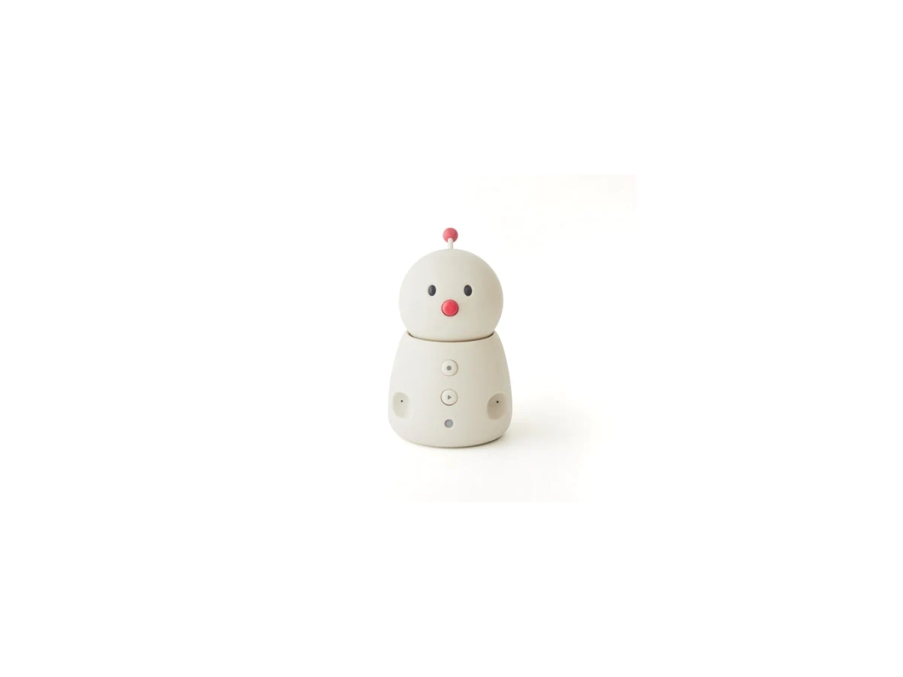</a>

官方宣传图 © Yukai Engineering · <a href="https://store.ux-xu.com/cdn/shop/products/product_bocco_emo.jpg?v=1592317204">原图来源</a>

> 将家庭留言、提醒和传感器连接结合起来的桌面通信机器人。

### 产品概述

BOCCO emo 可以转达手机应用中的消息，进行语音互动，并连接家庭传感器。它用身体动作和脸颊灯光表达提醒与回应，不依赖传统屏幕。

当前 Premium 计划增加生成式对话和互动记忆。根据已公开的计划说明，Wi-Fi 型号的基础留言和信息功能仍免费，LTE 租赁版使用另一套条款。

### 产品信息

| 项目 | 详情 |
|---|---|
| 产品名称 | BOCCO emo Wi-Fi 型号；YE-RB010-GWNJP |
| 开发者 / 机构 | Yukai Engineering / ユカイ工学 |
| 国家 / 地区 | 日本 |
| 产品类型 | 商业桌面家庭通信机器人 |
| 供应状态 | 日本官方商店在售；Wi-Fi 型号 |
| 首次发布 | 未知；本次未确认准确的首次零售日期 |
| 参考价格 | JPY 52,800，含日本消费税，核查于 2026-09-08 |
| AI 能力 | 语音互动；Premium 增加生成式对话和按声音关联的记忆 |
| 运动方式 | 固定底座上的头部/身体动作 |
| 开源 | 未知；公开云 API 不等于整机源码开放 |
| SDK/API | 公开 Platform API；适用开发者/非商业使用条件 |
| 主要功能 | 家庭留言、提醒、传感器通知及可选 AI 对话 |
| 支持语言 | 已有日语服务说明；其他语言是否具备同等支持未知 |
| 网络要求 | 所列型号需要 2.4 GHz Wi-Fi 和手机 |
| 云端依赖 | 留言、平台集成及 AI 对话依赖在线服务 |
| 订阅 | Wi-Fi 基础功能免费；可选 Premium JPY 1,700/月，含税 |
| 供电与充电 | 100–240 V AC 适配器；桌面插电使用 |
| 最近核查 | 2026-09-08 |

### 官方链接

- **官方网站：** [BOCCO emo](https://www.bocco.me/en/)
- **官方商店：** [Wi-Fi 型号](https://store.ux-xu.com/products/bocco-emo)
- **项目仓库：** 未知；未找到整机固件源码
- **文档：** [用户说明书](https://www.bocco.me/wp-content/uploads/2021/01/emo_manual_2_20210115.pdf)
- **SDK/API：** [Platform API](https://platform-api.bocco.me/api-docs/)
- **支持：** [官方使用及服务说明](https://www.bocco.me/living/premium/)
- **官方视频：** [产品演示](https://www.bocco.me/en/)
- **媒体素材：** [官方媒体文件夹](https://drive.google.com/drive/folders/1-w-wBQUaqldAOIboJrrlws2fdXj6QtxP)

### 主要特点

- 家庭成员与机器人之间的语音/文字消息。
- 传感器联动通知及定时提醒。
- 公开集成 API，以及可选的付费生成式对话。

### 注意事项

Premium 指南写明了对话配额，并说明不支持实时信息。API 公开也不代表可无限制商用。这里的参考价为买断 Wi-Fi 型号，不是 LTE 租赁价格。

### 信息来源

- [官方商店](https://store.ux-xu.com/products/bocco-emo)：价格、型号、网络及供电。
- [英文产品介绍](https://www.bocco.me/en/)：留言和传感器功能。
- [Premium 指南](https://www.bocco.me/living/premium/)：费用、免费基础功能及限制；[Premium 条款](https://www.bocco.me/terms-premium/)：外部 AI 服务。
- [API 发布公告](https://www.bocco.me/appnews/20211012/)：开发者/非商业条件；[Platform API](https://platform-api.bocco.me/api-docs/)：文档入口。

[↑ 返回总览](#comparison)

## Vector 2.0

  <a href="https://anki.bot/products/vector-robot">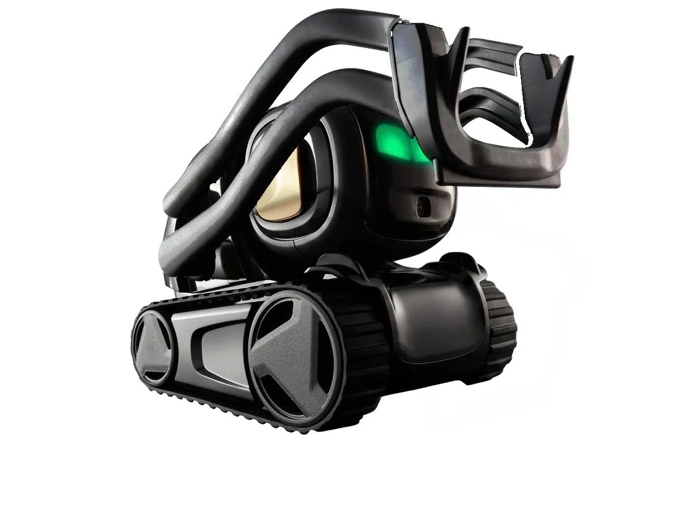</a>

官方宣传图 © Anki / Digital Dream Labs · <a href="https://anki.bot/cdn/shop/files/Vector_Product_ArmsUp_swap_1000px_d2c99795-151d-4095-8534-804920b159ed.jpg?v=1788848061">原图来源</a>

> 结合自主行为和订阅制云端语音服务的履带式桌面伙伴。

### 产品概述

Vector 集成相机、表情屏幕、履带底盘和小型举升机构。当前官方商店同时列出 Vector 2.0、开箱机和 OSKR 版本，它们面向不同使用方式，价格也不同。

原始 Anki Python SDK 仍可公开访问。社区维护的 wire-pod 提供自托管语音服务方案，但需要另行安装，也不是厂商提供的云订阅服务。

### 产品信息

| 项目 | 详情 |
|---|---|
| 产品名称 | Vector 2.0；旧款 Vector 1.0 属于不同硬件代际 |
| 开发者 / 机构 | 最初为 Anki；后续为 Digital Dream Labs / 当前 Anki 品牌商店 |
| 国家 / 地区 | 美国 |
| 产品类型 | 商业自主桌面陪伴机器人 |
| 供应状态 | 在售；官方称有库存、一个工作日内发货 |
| 首次发布 | 所列准确 2.0 零售配置的首次交付日期未知 |
| 参考价格 | 黑色 Vector 2.0 新机 USD 199.99；开箱机页面 USD 139.99 起，核查于 2026-09-08 |
| AI 能力 | 视觉、语音服务和自主宠物行为；当前模型集成属于厂商声明 |
| 运动方式 | 履带桌面移动；头部及举升臂运动 |
| 开源 | 部分：公开 SDK 及部分服务端组件，不是整机全部开放 |
| SDK/API | 公开的旧版 Python SDK；未测试与当前固件的兼容性 |
| 主要功能 | 可在桌面活动的宠物，支持语音互动及方块游戏 |
| 支持语言 | 有英语说明；当前各后端完整语言列表未知 |
| 网络要求 | 官方云端语音需要 Wi-Fi/互联网；自托管方案需要本地服务器 |
| 云端依赖 | 官方语音服务走厂商云端；无会员时仍保留部分自主行为 |
| 订阅 | ChatGPT 后端 USD 11.99/月或 99.99/年；Claude 后端 USD 14.99/月或 139.99/年 |
| 供电与充电 | 可充电并使用充电底座；应核对不同成色/套装是否包含充电器 |
| 最近核查 | 2026-09-08 |

### 官方链接

- **官方网站：** [Vector](https://anki.bot/products/vector-robot)
- **官方商店：** [Vector 2.0 及不同成色版本](https://anki.bot/products/vector-robot)
- **项目仓库：** [原始 Anki Vector SDK](https://github.com/anki/vector-python-sdk)
- **文档：** [SDK 文档源码](https://github.com/anki/vector-python-sdk/tree/master/docs)
- **SDK/API：** [Python SDK](https://github.com/anki/vector-python-sdk)
- **支持：** [Anki / DDL 支持](https://support.anki.bot/)
- **官方视频：** [产品演示](https://anki.bot/products/vector-robot)
- **媒体素材：** 未知

### 主要特点

- 自主履带运动及表情屏幕反应。
- 官方云端语音服务按所选模型后端分别收费。
- 保留旧版 SDK，并有独立的社区自托管路线。

### 注意事项

公开 SDK 仓库是开发接口存在过的依据，不是当前环境能够正常工作的证明。[wire-pod](https://github.com/kercre123/wire-pod) 属于**非官方**替代方案，需要单独评估安装要求和可选外部模型服务。这里没有测试任何一种语音服务方案。

### 信息来源

- [当前商店](https://anki.bot/products/vector-robot)：硬件价格、成色版本、库存声明及订阅边界。
- [会员指南，更新于 2026-08-10](https://support.anki.bot/article/344-all-about-memberships)：各模型后端收费及激活要求。
- [原始 SDK](https://github.com/anki/vector-python-sdk)：公开开发接口；[wire-pod 项目](https://github.com/kercre123/wire-pod)：社区服务器的适用范围。

[↑ 返回总览](#comparison)

## LOOI

  <a href="https://looirobot.com/products/looi-robot">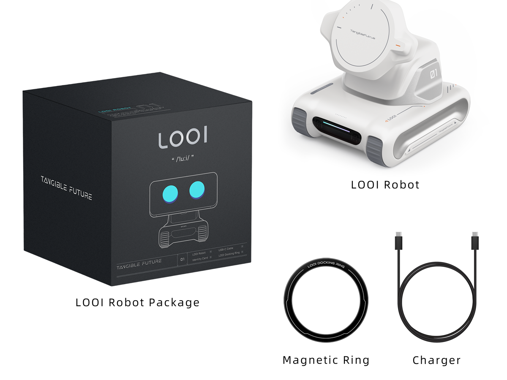</a>

官方产品图 © TangibleFuture · <a href="https://looirobot.com/cdn/shop/files/b66ad06154607d964bb5e6f076cba988_d37a7992-3775-4623-b502-5469be1197b3.png?v=1773643379">原图来源</a>

> 用兼容手机提供屏幕、相机和主要计算能力的电动桌面陪伴底座。

### 产品概述

LOOI 将双轮底座、可俯仰手机支架、桌沿/障碍感知、无线充电、扬声器和手机应用组合在一起。TangibleFuture 宣传其支持 ChatGPT/Gemini 对话、人脸与手势识别、视觉感知及宠物式行为。

手机是机器人不可缺少的一部分，但不随产品附送。商品页强调本地处理；隐私政策同时明确写有云端 AI 服务商会处理语音、对话记忆和可选的单帧图像，判断云端边界时应以更具体的隐私条款为准。

### 产品信息

| 项目 | 详情 |
|---|---|
| 产品名称 | LOOI Robot；型号 L-01 |
| 开发者 / 机构 | TangibleFuture |
| 国家 / 地区 | 中国 / 美国众筹团队；开发运营与早期活动横跨两地 |
| 产品类型 | 商业智能手机驱动桌面伙伴 |
| 供应状态 | 官方商店可下单；处理时间和配送目的地不同 |
| 首次发布 | 2024 年发起众筹；目前有零售商品页 |
| 参考价格 | USD 239 促销价；页面常规价 USD 259，核查于 2026-09-09；不含手机 |
| AI 能力 | 官方称支持 ChatGPT/Gemini 对话、人脸/手势识别、视觉感知及自适应行为 |
| 运动方式 | 双轮桌面移动和手机俯仰；手机作为“脸” |
| 开源 | 未知；未找到完整源码发布或明确开放许可 |
| SDK/API | 未公开 |
| 主要功能 | 将兼容手机变为可移动的对话桌面伙伴和无线充电器 |
| 支持语言 | 应用商店列有多种界面语言；完整语音对话语言覆盖未知 |
| 网络要求 | 兼容手机、Bluetooth/应用设置；云端 AI 功能需要互联网 |
| 云端依赖 | 语音、对话记忆及可选视觉理解可能由云端 AI 服务商处理 |
| 订阅 | 当前完整订阅和使用额度条款未能确认 |
| 供电与充电 | 6,000 mAh，标称最长约 5 小时；10 W 手机无线充电 |
| 最近核查 | 2026-09-09 |

### 官方链接

- **官方网站：** [LOOI](https://looirobot.com/)
- **官方商店：** [LOOI Robot](https://looirobot.com/products/looi-robot)
- **项目仓库：** 未公开
- **文档：** [帮助中心](https://looirobot.com/pages/help-center)
- **SDK/API：** 未公开
- **支持：** [联系与支持](https://looirobot.com/pages/contact)
- **官方视频：** [商品页演示](https://looirobot.com/products/looi-robot)
- **媒体素材：** 未知

### 主要特点

- 复用手机屏幕和相机，底座不重复配置这些部件。
- 支持轮式移动、手机俯仰、桌沿感知和障碍感知。
- 同时提供手机无线充电及对话/视觉云端功能。

### 注意事项

购买前应核对兼容列表：当前页面要求 iOS 17+ 或 Android 12+，并建议 Android 使用 Snapdragon 8 Gen 1 或以上。手机不包含在内。隐私条款比“本地处理”的标题宣传更细致，其中明确列出了发送给云端 AI 服务商的数据。本次未找到公开硬件 SDK 或完整机器人源码。

### 信息来源

- [官方产品页](https://looirobot.com/products/looi-robot)：价格、下单、手机要求、运动、电池、充电及宣传功能。
- [官方隐私政策](https://looirobot.com/pages/privacy-policy)：云端 AI 数据类别及可选图像处理。
- [官方帮助中心](https://looirobot.com/pages/help-center)：设置与支持入口。

[↑ 返回总览](#comparison)

## Loona Deskmate

  <a href="https://keyirobot.com/en-us/products/deskmate">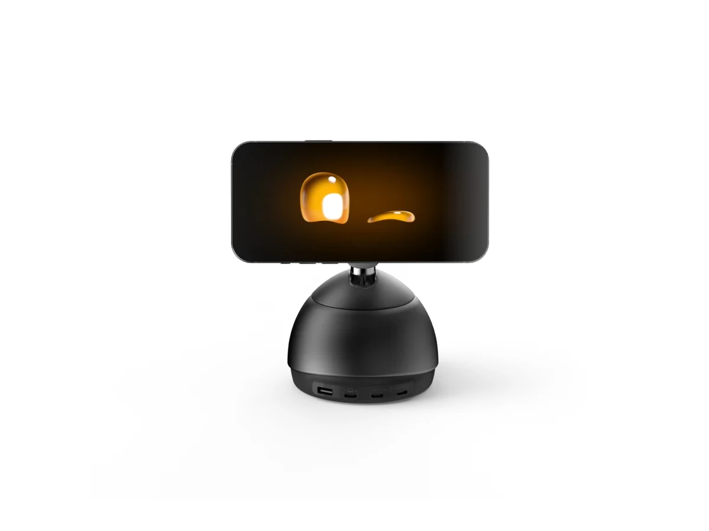</a>

官方宣传图 © KEYi Tech / Loona · 手机用于演示 · <a href="https://cdn.shopify.com/s/files/1/0750/4170/2077/files/gallery-deskmate-obsidian-1-v1.webp?v=1782099702">原图来源</a>

> 通过可动 iPhone 底座，为 AI 工作助手提供桌面实体交互形式。

### 产品概述

Loona Deskmate 使用安装在三轴电动底座上的 iPhone 进行感知和交互。厂商宣传会议准备、回复草稿、提醒以及工作工具连接等功能。

产品页称面部和注意信号在 iPhone 上处理，而任务指令发往云服务。这些均属于厂商声明。它与主要在地面移动的 Loona Petbot 是不同产品。

### 产品信息

| 项目 | 详情 |
|---|---|
| 产品名称 | Loona Deskmate / DeskMate；Obsidian 商品页 |
| 开发者 / 机构 | KEYi Tech / Loona |
| 国家 / 地区 | 中国；公司历史说明起源于北京 |
| 产品类型 | 商业电动手机底座 / AI 桌面助手 |
| 供应状态 | 美国官方页面提供购买按钮；具体交期未知 |
| 首次发布 | 2026 年 1 月 CES 期间介绍；首次交付日期未知 |
| 参考价格 | USD 299，不含必需的 iPhone，核查于 2026-09-08 |
| AI 能力 | 厂商称具备 iPhone 感知、云端对话、记忆及工作工具集成 |
| 运动方式 | 手机支架三轴偏航/俯仰/翻滚；底座固定 |
| 开源 | 未知 |
| SDK/API | 未知；宣传 MCP 集成不等于提供公开硬件 SDK |
| 主要功能 | 可动手机底座形式的 AI 工作辅助、草稿准备及提醒 |
| 支持语言 | 未知；网页翻译不能证明支持对应的语音语言 |
| 网络要求 | 兼容 iPhone 及在线服务；官方页列为 iPhone 12+ |
| 云端依赖 | 明确的任务指令走云端；面部/注意信号称留在 iPhone 本地 |
| 订阅 | 未知；未找到完整的当前收费及权益条款 |
| 供电与充电 | 插电底座；宣传 Qi2 手机充电；供电规格差异见下文 |
| 最近核查 | 2026-09-08 |

### 官方链接

- **官方网站：** [Deskmate](https://keyirobot.com/en-us/products/deskmate)
- **官方商店：** [美国商品页](https://keyirobot.com/en-us/products/deskmate)
- **项目仓库：** 未知
- **文档：** [产品规格](https://keyirobot.com/en-us/products/deskmate)
- **SDK/API：** 未知
- **支持：** [Loona 支持中心](https://supportcenter.keyirobot.com/en/)
- **官方视频：** [产品演示](https://keyirobot.com/en-us/products/deskmate)
- **媒体素材：** 未知

### 主要特点

- 实体转动和手机端动画交互。
- 宣传支持日历、邮件草稿及会议上下文集成。
- 电动支架同时提供手机充电功能。

### 注意事项

必需的 iPhone 不包含在 USD 299 参考价内。页面写有 165 W 供电，同时装箱清单写有 180 W 充电器，可能是不同额定口径，本次未进一步核实。助手集成、延迟及隐私声明均未独立测试。

### 信息来源

- [美国商品页面](https://keyirobot.com/en-us/products/deskmate)：价格、手机要求、运动、云端声明及供电标注。
- [公司历史](https://keyirobot.com/about-us)：开发者起源。
- [官方发布/新闻目录](https://keyirobot.com/blogs/news)：2026 年 1 月发布；[日本介绍页](https://makuake.keyirobot.com/)：手机兼容性说明。

[↑ 返回总览](#comparison)

## Reachy Mini

  <a href="https://huggingface.co/blog/reachy-mini">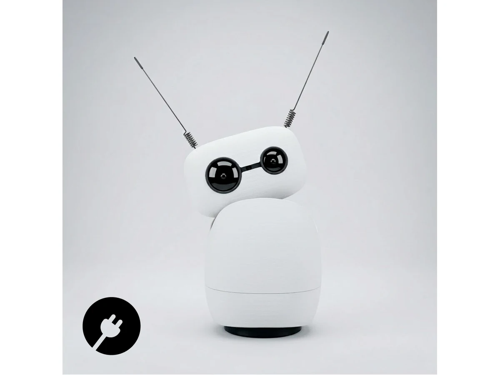</a>

官方宣传图 © Pollen Robotics / Hugging Face · 图为 Lite · <a href="https://store.pollen-robotics.com/cdn/shop/files/reachy-mini-lite.png?v=1776692700">原图来源</a>

> 用于实验视觉、音频和 AI 应用的可编程桌面机器人本体。

### 产品概述

Reachy Mini 提供可表达情绪的头部动作、旋转身体、天线、相机、麦克风和扬声器。Lite 通过外接电脑运行，Wireless 增加 Raspberry Pi CM4 板载计算和电池。

项目公开了 SDK、示例及仿真资源。AI 行为由安装的应用和模型决定。硬件设计许可带有非商业限制，因此本清单将其归为“部分开源”，并保留产品本身的开源定位说明。

### 产品信息

| 项目 | 详情 |
|---|---|
| 产品名称 | Reachy Mini Lite / Reachy Mini Wireless |
| 开发者 / 机构 | Pollen Robotics / Hugging Face |
| 国家 / 地区 | Pollen Robotics 位于法国；商店注明在波尔多设计、中国制造 |
| 产品类型 | 开发 / 教育桌面机器人套件 |
| 供应状态 | 两个版本均可订购；商店标称交期最长 90 天 |
| 首次发布 | 2025-07-09 公布；交付日期因版本/批次而异 |
| 参考价格 | 当前官方产品页 Lite USD 399；Wireless USD 499，核查于 2026-09-09 |
| AI 能力 | 可编程视觉/音频/模型应用；实际能力取决于应用及计算资源 |
| 运动方式 | 六自由度头部、身体旋转及两根可动天线；不行走 |
| 开源 | 部分：SDK 为 Apache-2.0；硬件文件被描述为 CC BY-SA-NC，带非商业限制 |
| SDK/API | 公开 Python 和 JavaScript 接口 |
| 主要功能 | 用于开发 AI 交互和机器人实验的表达式平台 |
| 支持语言 | 由应用/模型决定；没有统一的整机语言保证 |
| 网络要求 | Lite 使用 USB-C 连接电脑；Wireless 提供 Wi-Fi/板载计算 |
| 云端依赖 | 由应用决定；提供本地控制和仿真 |
| 订阅 | 未发现强制整机订阅；所选云服务/模型供应商可能收费 |
| 供电与充电 | Lite 提供外接电源；Wireless 增加电池并附电源 |
| 最近核查 | 2026-09-09 |

### 官方链接

- **官方网站：** [项目介绍](https://huggingface.co/blog/reachy-mini)
- **官方商店：** [Lite](https://store.pollen-robotics.com/products/reachy-mini-lite-version) · [Wireless](https://store.pollen-robotics.com/products/reachy-mini-wireless-version)
- **项目仓库：** [reachy_mini](https://github.com/pollen-robotics/reachy_mini)
- **文档：** [官方 SDK 及指南](https://github.com/pollen-robotics/reachy_mini#readme)
- **SDK/API：** [SDK 源码](https://github.com/pollen-robotics/reachy_mini)
- **支持：** [项目问题跟踪](https://github.com/pollen-robotics/reachy_mini/issues)
- **官方视频：** [介绍及演示](https://huggingface.co/blog/reachy-mini)
- **媒体素材：** 未知

### 主要特点

- 头部、身体、天线协调表达，并可访问相机和音频。
- 公开编程接口及 MuJoCo 仿真资源。
- 外接电脑和板载计算两种版本。

### 注意事项

它们是需要组装的套件，不能保证开箱即得到完整对话伙伴。早期发布价和地区商店价格不能替代本次访问到的美元现价。商用复用前应查看硬件许可，并确认目的地配送和税费。

### 信息来源

- [发布公告](https://huggingface.co/blog/reachy-mini)：日期和产品概念。
- [Lite 商店](https://store.pollen-robotics.com/products/reachy-mini-lite-version) · [Wireless 商店](https://store.pollen-robotics.com/products/reachy-mini-wireless-version)：当前价格、硬件、设计/制造地及交期。
- [项目 README 与许可说明](https://github.com/pollen-robotics/reachy_mini)：SDK、仿真及硬件许可限制。

[↑ 返回总览](#comparison)

## Microduck

  

官方新闻照片 © Pollen Robotics · <a href="https://pollen-robotics.com/assets/microduck/press/photos/microduck-closeup.jpg">原图来源</a>

> 身高 25 cm、15 自由度，围绕开源软件、仿真和强化学习栈构建的双足机器鸭子。

### 产品概述

Microduck 是 Pollen Robotics 继 Reachy Mini 后的第二款消费级机器人，也是该公司的首款双足机器人。Pollen Robotics 自 2025 年起属于 Hugging Face。机器人含 15 个电机、相机、8×8 ToF 深度传感器、两枚 IMU、麦克风、扬声器和 Rockchip RK3566 板载计算机。

首发公布了 7 组训练动作，包括行走、站立/坐下、踢、抓、跌倒后起身，以及安装可选轮子后的轮滑。运动策略以 50 Hz 在本机运行。软件、仿真和训练栈使用 Apache-2.0 开放，但官方明确说明机械和电子设计文件不属于开源内容。

### 产品信息

| 项目 | 详情 |
|---|---|
| 产品名称 | Microduck |
| 开发者 / 机构 | Pollen Robotics / Hugging Face |
| 国家 / 地区 | 法国；在波尔多设计 |
| 产品类型 | 预售中的可编程双足桌面机器人 |
| 供应状态 | 2026-08-27 开放预售；首批目标在 2026 年圣诞节前交付 |
| 首次发布 | 2026-08-27 公布并开放预售 |
| 参考价格 | USD 399 首发价，税费和运费另计，核查于 2026-09-09；欧盟商店显示 EUR 340 |
| AI 能力 | 50 Hz 板载学习运动策略；相机及深度感知；支持用户训练行为 |
| 运动方式 | 15 自由度双足行走、坐/站、跌倒起身、踢/抓及可选轮滑 |
| 开源 | 部分：完整软件/仿真/训练栈为 Apache-2.0；机械和电子设计文件不开放 |
| SDK/API | 公开软件仓库；最终支持的 SDK 编程语言仍在确定 |
| 主要功能 | 用于动作、强化学习实验和表达式互动的可编程双足平台 |
| 支持语言 | 编程语言支持仍在确定；未公布对话语言清单 |
| 网络要求 | 提供 Wi-Fi 和 Bluetooth；核心 50 Hz 运动策略在本机运行 |
| 云端依赖 | 核心运动在本机；可选用 Hugging Face Jobs 进行托管训练 |
| 订阅 | 未公布强制订阅 |
| 供电与充电 | 可拆卸 NP-F550 2,600 mAh 电池；标称续航约 1 小时 |
| 最近核查 | 2026-09-09 |

### 官方链接

- **官方网站：** [Microduck](https://pollen-robotics.com/microduck/)
- **官方商店：** [Microduck 预售](https://store.pollen-robotics.com/products/microduck)
- **项目仓库：** [pollen-robotics/microduck](https://github.com/pollen-robotics/microduck)
- **文档：** [仓库 README](https://github.com/pollen-robotics/microduck#readme)
- **SDK/API：** [开源软件栈](https://github.com/pollen-robotics/microduck)
- **支持：** [GitHub Issues](https://github.com/pollen-robotics/microduck/issues)
- **官方视频：** [产品页演示](https://pollen-robotics.com/microduck/)
- **媒体素材：** [官方 Press Kit](https://pollen-robotics.com/microduck/press-kit/)

### 主要特点

- 不到 800 g 的机身内有 15 个驱动自由度。
- 板载学习运动策略，并能在跌倒后起身。
- 开放仿真/训练软件，面向自定义技能和强化学习。

### 注意事项

这是预售产品，不能等同于已经验证交付的零售硬件。首发仅覆盖部分北美、欧洲和亚洲目的地，税费及运费不同。同名 [microduck.net](https://microduck.net/) 自己注明是受该机器人启发的非官方社区代币，并非机器人产品官网；产品事实应以 Pollen Robotics 及其 GitHub 仓库为准。

### 信息来源

- [官方产品页](https://pollen-robotics.com/microduck/)：定位、硬件、动作、本地策略循环和发布信息。
- [官方 Press Kit](https://pollen-robotics.com/microduck/press-kit/)：尺寸、重量、传感器、计算、电池、价格、供应及开源边界。
- [官方商店](https://store.pollen-robotics.com/products/microduck)：预售状态、地区价格和交付目标。
- [官方仓库](https://github.com/pollen-robotics/microduck)：Apache-2.0 软件和当前开发资源。

[↑ 返回总览](#comparison)

## Doly

  <a href="https://shop.doly.ai/products/doly">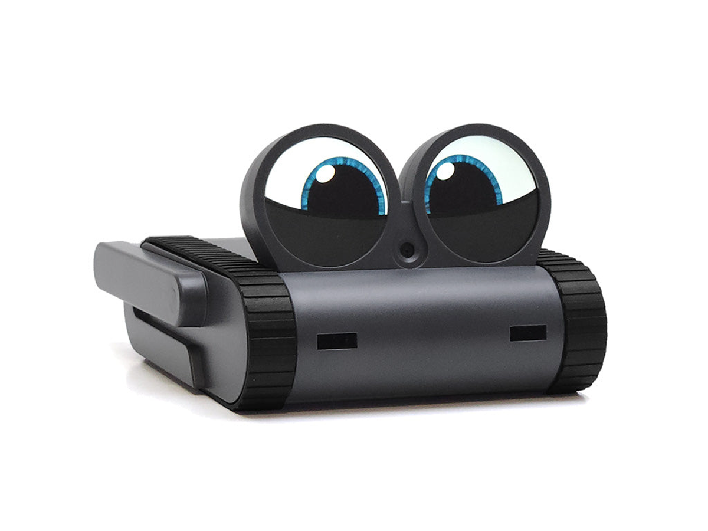</a>

官方产品图 © Limitbit / Doly · <a href="https://shop.doly.ai/cdn/shop/files/doly.jpg?v=1774476099">原图来源</a>

> 基于 Raspberry Pi CM4、可组装和修改，并提供 Python/C++ 接口的履带式陪伴机器人。

### 产品概述

Doly 将履带底盘、可动头部和手臂、相机、麦克风、扬声器、显示屏及 Raspberry Pi Compute Module 4 组合起来。Limitbit 将核心视觉、语音和行为功能描述为本地运行，并表示基础使用不强制云端订阅。

DOLY-DIY 仓库提供机械文件、电子资料、固件/SDK 资源和 Python/C++ 示例。其 CC BY-NC-SA 4.0 许可证限制商业用途，因此本清单标为“部分开源”，不把公开文件等同于不受限制的开源硬件。

### 产品信息

| 项目 | 详情 |
|---|---|
| 产品名称 | Doly |
| 开发者 / 机构 | Limitbit Inc. |
| 国家 / 地区 | 加拿大；项目众筹所在地为安大略省 Markham |
| 产品类型 | 商业 DIY 陪伴与开发机器人 |
| 供应状态 | 官方商店可下单；本地化站点的价格/货币可能不同 |
| 首次发布 | 2024 年发起众筹；目前有零售商品页 |
| 参考价格 | 官方页显示 1 GB / 32 GB 配置 USD 562，核查于 2026-09-09 |
| AI 能力 | 开发者称支持本地计算机视觉、语音、个性及行为生成 |
| 运动方式 | 履带桌面移动、手臂动作和可动头部 |
| 开源 | 部分：硬件/电子/软件资源以 CC BY-NC-SA 4.0 公开；商用许可另行处理 |
| SDK/API | 公开 Python 和 C++ SDK/示例 |
| 主要功能 | 可组装、可编程的陪伴机器人，用于机器人、编程和 AI 实验 |
| 支持语言 | 已记录英语；其他完整语言覆盖未知 |
| 网络要求 | 设置和联网功能使用 Wi-Fi/应用；核心运行宣传为本地 |
| 云端依赖 | Limitbit 称核心功能设计为本地运行 |
| 订阅 | 宣传不强制订阅 |
| 供电与充电 | 可充电并带充电站；当前官方容量/续航未确认 |
| 最近核查 | 2026-09-09 |

### 官方链接

- **官方网站：** [Doly](https://doly.ai/)
- **官方商店：** [Doly 商品页](https://shop.doly.ai/products/doly)
- **项目仓库：** [robotdoly/DOLY-DIY](https://github.com/robotdoly/DOLY-DIY)
- **文档：** [DOLY-DIY 文档](https://robotdoly.github.io/DOLY-DIY/)
- **SDK/API：** [Python 和 C++ 资源](https://github.com/robotdoly/DOLY-DIY)
- **支持：** [Doly 支持](https://doly.ai/support/)
- **官方视频：** [Doly 频道](https://www.youtube.com/@DolyRobot)
- **媒体素材：** 未知

### 主要特点

- Raspberry Pi CM4 计算平台及公开修改、编程资源。
- 履带移动、动画表情、可动手臂和头部。
- 开发者称核心功能本地运行，不强制云端订阅。

### 注意事项

公开许可证带非商业限制，商用应联系开发者。商店可能按访问位置切换货币和价格，不应假定所有访客都看到 USD 562。公开源码文件也不能独立证明出货软件的所有组件均开放，或所有宣传 AI 功能都能完全离线运行。

### 信息来源

- [官方商店](https://shop.doly.ai/products/doly)：当前下单页、配置、价格及包含硬件。
- [官方产品介绍](https://doly.ai/companion/)：本地运行和不强制订阅的声明。
- [Limitbit 介绍](https://doly.ai/about-us/)：开发者身份和开放机器人定位。
- [DOLY-DIY 仓库](https://github.com/robotdoly/DOLY-DIY)：许可证、文件、SDK 语言及示例。
- [官方文档](https://robotdoly.github.io/DOLY-DIY/)：组装和编程资料。

[↑ 返回总览](#comparison)

## Stack-chan / ｽﾀｯｸﾁｬﾝ / M5StackChan

  <a href="https://github.com/stack-chan/stack-chan">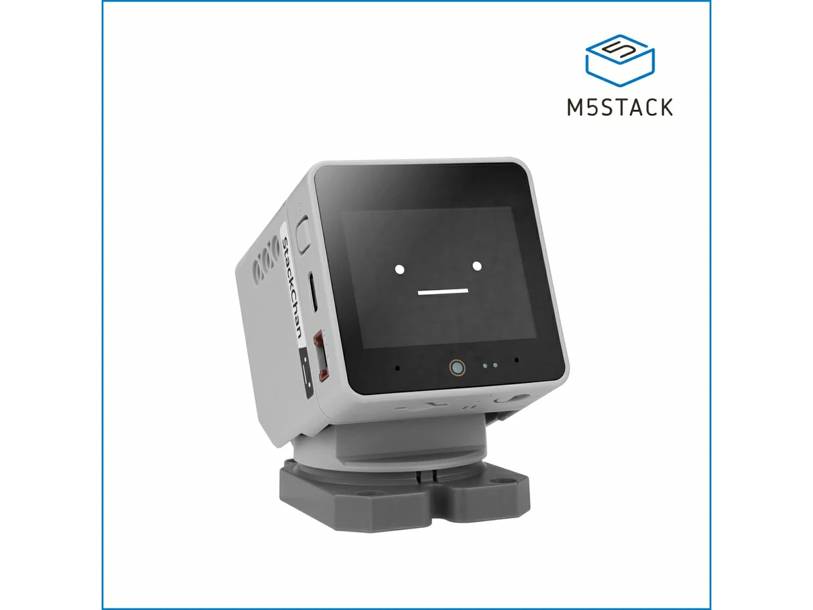</a>

官方宣传图 © M5Stack · 图为 K151 · <a href="https://shop.m5stack.com/cdn/shop/files/1_29c1c66c-6170-4270-ba77-7d3bf4793c7b_1200x1200.webp?v=1776925002">原图来源</a>

> 可自定义表情、具有两轴动作和公开固件的小型社区机器人。

### 产品概述

Stack-chan 是围绕 M5Stack 硬件建立的社区项目，提供固件、外壳文件、电路图及浏览器工具。当前社区 README 推荐预组装的 M5StackChan K151 作为入门配置。

M5Stack 出厂固件与社区 JavaScript 固件是不同的软件选择。出厂功能包含 AI Agent，社区用户可以自行编写行为与集成。刷入社区固件会替换出厂版本。

### 产品信息

| 项目 | 详情 |
|---|---|
| 产品名称 | Stack-chan / ｽﾀｯｸﾁｬﾝ；商业配置为 M5StackChan K151 |
| 开发者 / 机构 | Shinya Ishikawa 及社区；M5Stack 硬件 |
| 国家 / 地区 | 日本 / 中国；对应社区起源及 M5Stack 硬件机构 |
| 产品类型 | 带商业硬件选项的开源 DIY 项目 |
| 供应状态 | 可开源自制；K151 官方商店列有库存 |
| 首次发布 | 社区项目：2021 年；K151 首次交付日期未知 |
| 参考价格 | M5StackChan K151 USD 99；自制成本不固定，核查于 2026-09-08 |
| AI 能力 | 取决于固件；K151 文档列有出厂 AI Agent 及相机/音频集成 |
| 运动方式 | 两轴旋转/俯仰；底座固定；K151 标称水平 360°、垂直 90° |
| 开源 | 社区项目是，使用 Apache-2.0；不能据此推定所有出厂组件/服务均开放 |
| SDK/API | 社区固件/API 公开；M5Stack 提供 Arduino 和 UiFlow2 开发说明 |
| 主要功能 | 可自定义表情、行为和 AI 集成的小型 ESP32 机器人 |
| 支持语言 | 由固件/模型决定；没有全项目统一的语音语言保证 |
| 网络要求 | K151 支持 2.4 GHz Wi-Fi 和 BLE；云端 AI 需要网络 |
| 云端依赖 | 由固件/应用决定；可编写本地行为 |
| 订阅 | 当前出厂/模型服务费用未知；第三方集成可能另外收费 |
| 供电与充电 | K151 使用 USB-C 供电/数据连接，550 mAh 电池；自制版本不同 |
| 最近核查 | 2026-09-08 |

### 官方链接

- **官方网站：** [社区项目](https://github.com/stack-chan/stack-chan)
- **官方商店：** [M5StackChan K151](https://shop.m5stack.com/products/stackchan-kawaii-co-created-open-source-ai-desktop-robot)
- **项目仓库：** [stack-chan](https://github.com/stack-chan/stack-chan)
- **文档：** [M5Stack 硬件/出厂指南](https://docs.m5stack.com/en/StackChan) · [社区指南](https://github.com/stack-chan/stack-chan/tree/develop/docs)
- **SDK/API：** [社区固件 API](https://github.com/stack-chan/stack-chan/blob/develop/firmware/docs/api.md)
- **支持：** [社区问题跟踪](https://github.com/stack-chan/stack-chan/issues)
- **官方视频：** [创作者介绍](https://youtu.be/fZb_mF08xV0)
- **媒体素材：** 未知

### 主要特点

- 公开社区固件、可打印外壳及电路图。
- 浏览器固件安装器、表情工具及行为开发。
- K151 集成相机、麦克风、触摸感应和两个舵机。

### 注意事项

应使用与实际硬件及固件组合对应的文档。K151 的参数和价格不能代表所有社区自制版本。更换固件会改变功能集合，公开项目中提供了恢复出厂固件的说明。

### 信息来源

- [社区仓库](https://github.com/stack-chan/stack-chan)：项目历史、许可、支持的开发板及固件区别。
- [K151 商店](https://shop.m5stack.com/products/stackchan-kawaii-co-created-open-source-ai-desktop-robot)：配置、价格和库存声明。
- [K151 文档](https://docs.m5stack.com/en/StackChan)：出厂 AI、网络、运动和供电。

[↑ 返回总览](#comparison)

## ELEGNT — 表达式台灯机器人研究

  <a href="https://machinelearning.apple.com/research/elegnt-expressive-functional-movement">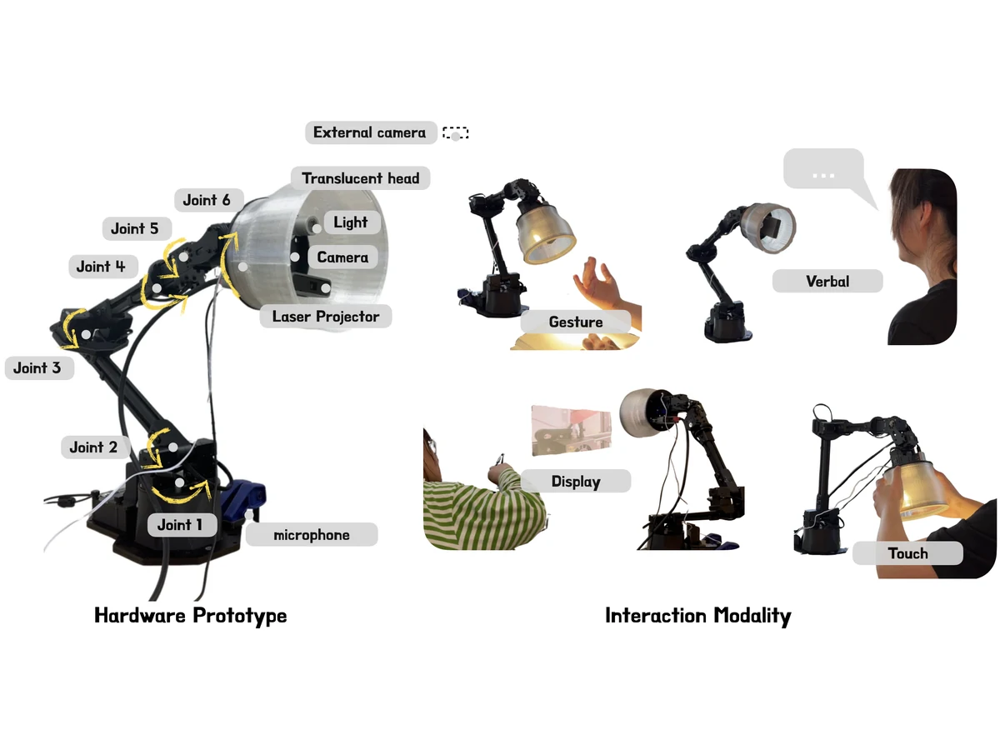</a>

研究配图 © ELEGNT 作者 / Apple · 作者论文图 4，不是零售产品照片 · <a href="https://arxiv.org/html/2501.12493v1/figure/prototype2.png">原图来源</a>

> 研究如何通过日常物件的运动表达注意和意图的桌面交互案例。

### 产品概述

ELEGNT 使用台灯形机器人研究表达式动作。作者将仅用于完成功能的运动，与通过姿态、时序和朝向表达内部状态的运动进行比较。

论文使用设计好的交互场景和基于视频的用户研究。它提供桌面交互设计方面的研究证据，不代表苹果正在销售该机器人，也不能证明量产自主助手的能力。

### 产品信息

| 项目 | 详情 |
|---|---|
| 产品名称 | ELEGNT 研究框架及台灯形原型 |
| 开发者 / 机构 | 苹果研究者 Yuhan Hu、Peide Huang、Mouli Sivapurapu、Jian Zhang |
| 国家 / 地区 | 美国；论文机构署名为 Apple, Cupertino |
| 产品类型 | 研究原型 / 人机交互研究 |
| 供应状态 | 所引研究材料中没有对外销售安排 |
| 首次发布 | 2025 年 1 月研究论文；不是商业发售 |
| 参考价格 | 不适用 |
| AI 能力 | 该研究未证明自主 AI 能力；内容主要为动作表达和交互研究 |
| 运动方式 | 固定底座上的六轴台灯形机械臂 |
| 开源 | 未知；公开论文不等于实现开源 |
| SDK/API | 所引研究材料中未公开 |
| 主要功能 | 研究如何在完成实用任务的同时用动作表达注意和意图 |
| 支持语言 | 未知；不是受支持的消费级语言规格 |
| 网络要求 | 未知；研究环境，没有消费级配置约定 |
| 云端依赖 | 未知 |
| 订阅 | 不适用于该研究原型 |
| 供电与充电 | 未知；未公布消费级供电及充电规格 |
| 最近核查 | 2026-09-08 |

### 官方链接

- **官方网站：** [苹果研究页](https://machinelearning.apple.com/research/elegnt-expressive-functional-movement)
- **官方商店：** 未公开；研究原型
- **项目仓库：** 未知
- **文档：** [作者论文](https://arxiv.org/html/2501.12493v1)
- **SDK/API：** 未公开
- **支持：** 未公开；仅有研究论文
- **官方视频：** [苹果托管的演示](https://machinelearning.apple.com/research/elegnt-expressive-functional-movement)
- **媒体素材：** 未知；上图使用已注明来源的研究配图

### 主要特点

- 用台灯形态探索桌面表达式运动。
- 同时考虑动作的功能目标和表达目标。
- 公开用户研究方法及交互示例。

### 注意事项

研究中有 21 名参与者，观看六类任务场景的视频并评价。它没有证明长期真实环境运行，也没有确立消费级发售、云服务或售价。所用图片为论文配图，并非零售产品宣传素材。

### 信息来源

- [苹果研究摘要](https://machinelearning.apple.com/research/elegnt-expressive-functional-movement)：项目范围和演示。
- [作者论文第 3–4 节](https://arxiv.org/html/2501.12493v1)：原型、按脚本设计的研究环境、评估和图片来源。

[↑ 返回总览](#comparison)

## Cozmo — 初代已停产，2.0 已公布

  <a href="https://anki.bot/products/cozmo-robot">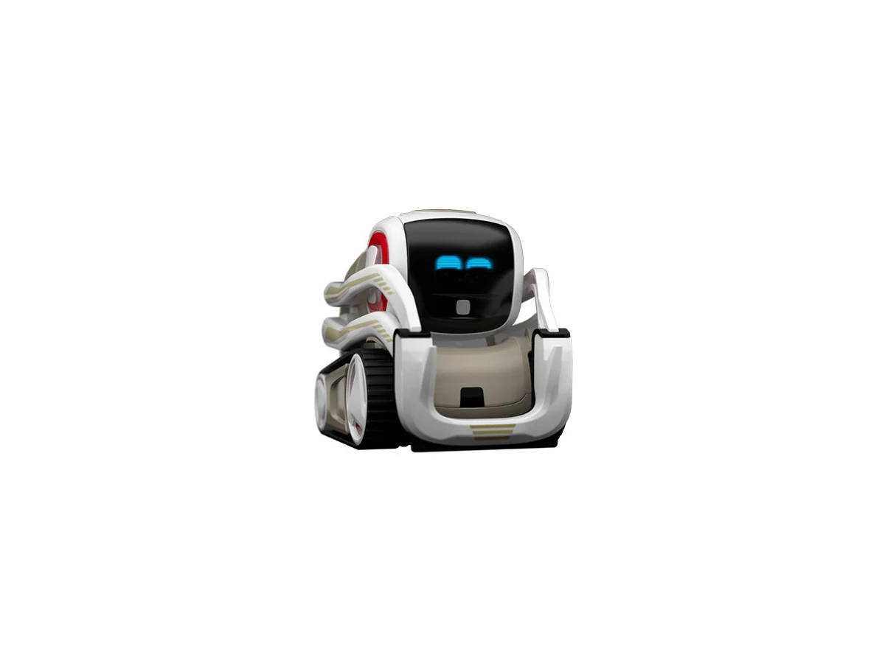</a>

官方宣传图 © Anki / Digital Dream Labs · 图为已公布的 Cozmo 2.0，不代表已交付 · <a href="https://anki.bot/cdn/shop/products/Cozmo2.0-500x405_5.jpg?v=1658947111">原图来源</a>

> 以方块游戏和公开 Python 编程接口为特点、具有历史价值的桌面机器人。

### 产品概述

原始 Cozmo 通过履带机身、举升臂、相机和手机/平板应用提供方块游戏及编程功能。虽然配套软件生态逐渐老化，公开 SDK 仍使其具有桌面机器人学习参考价值。

当前商店介绍了 Cozmo 2.0 的升级，但同时标注“即将推出”和缺货。本条目区分已停产的初代 Cozmo 与尚未核实交付的新一代声明。

### 产品信息

| 项目 | 详情 |
|---|---|
| 产品名称 | Cozmo（初代）；已公布的 Cozmo 2.0 |
| 开发者 / 机构 | 最初为 Anki；后续为 Digital Dream Labs / 当前 Anki 品牌商店 |
| 国家 / 地区 | 美国 |
| 产品类型 | 已停产的教育桌面机器人；已公布后继型号 |
| 供应状态 | 初代已停产；2.0 已公布但尚未发售，商店页标为即将推出 / 缺货 |
| 首次发布 | 本次未复核旧款准确发售日期；2.0 首次交付未知 |
| 参考价格 | Cozmo 2.0 标价 USD 399.99，但缺货，核查于 2026-09-08；不跟踪旧款二手价格 |
| AI 能力 | 视觉/方块识别及编程行为；2.0 升级仍为厂商声明 |
| 运动方式 | 履带移动、头部运动和举升臂 |
| 开源 | 部分：原始 Python SDK 源码公开，并非整机开放 |
| SDK/API | 公开的旧版 Python SDK；当前应用/系统/固件兼容性未测试 |
| 主要功能 | 方块游戏和机器人编程入门 |
| 支持语言 | 当前应用/地区语言支持未知 |
| 网络要求 | 需要兼容手机/平板及 Cozmo 应用；使用旧款机器人与应用的连接方式 |
| 云端依赖 | 运行依赖应用；当前配置流程/服务可用性未知 |
| 订阅 | 当前服务条款未知；不能把 Vector 的会员条款套用到 Cozmo |
| 供电与充电 | 可充电机器人及充电器；二手购买应核对充电器、方块电池及机身电池状况 |
| 最近核查 | 2026-09-08 |

### 官方链接

- **官方网站：** [Cozmo](https://anki.bot/products/cozmo-robot)
- **官方商店：** [Cozmo 2.0 页面及配件](https://anki.bot/products/cozmo-robot)
- **项目仓库：** [原始 Cozmo Python SDK](https://github.com/anki/cozmo-python-sdk)
- **文档：** [SDK 文档源码](https://github.com/anki/cozmo-python-sdk/tree/master/docs)
- **SDK/API：** [Python SDK](https://github.com/anki/cozmo-python-sdk)
- **支持：** [Anki / DDL 支持](https://support.anki.bot/)
- **官方视频：** [官方产品介绍](https://anki.bot/products/cozmo-robot)
- **媒体素材：** 未知

### 主要特点

- 方块操作及有表现力的履带运动。
- 应用内编程活动和旧版 Python 示例。
- 易于接近的机器人交互设计历史案例。

### 注意事项

SDK 仓库可访问，并不保证当前手机能安装或运行必需应用。购买二手设备前应验证完整系统能够工作。2.0 宣传图和显示的价格都不能作为已经可以交付的证据。

### 信息来源

- [当前 Cozmo 页面](https://anki.bot/products/cozmo-robot)：应用要求、2.0 定位、价格及供应状态。
- [原始 Anki SDK](https://github.com/anki/cozmo-python-sdk)：旧版公开 API 和文档源码。

[↑ 返回总览](#comparison)

## 参与维护

添加机器人或纠错请参阅 [CONTRIBUTING.md](CONTRIBUTING.md)。请同时维护两种语言，并附带注明日期的官方来源。推荐产品和纠错可使用仓库的 **Add a robot** 或 **Report an error** Issue 模板。

仓库原创文字和代码使用 [MIT 许可](LICENSE)。产品图片、研究配图、标志和商标属于各自权利人，**不因本仓库的 MIT 许可而重新授权**。图片引用说明来源，不代表一揽子转载许可。首批图片采用已标注权属的官方宣传/新闻素材及一张明确说明的研究配图，仍须遵守各来源的具体使用条款。
